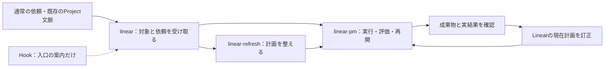

# Linear skills

指定したLinear Projectの計画・実行・訂正・保守を、Codexと通常のツールで進める3つのスキルです。コード、資料、外部サービス、人への引継ぎを扱います。

| スキル | 役割 |
|---|---|
| [linear](skills/linear/SKILL.md) | 対象・正本・依頼から必要なRefresh／PMを選ぶ入口 |
| [linear-refresh](skills/linear-refresh/SKILL.md) | 原要求と指定実態から計画を構築・再整理 |
| [linear-pm](skills/linear-pm/SKILL.md) | 現在計画から実行・評価・訂正・保守・再開 |

状態と受入の規則は[共通契約](skills/linear/references/contract.md)が所有します。入口の暗黙選択と、対象文脈で入口を案内する[Hook](hooks/README.md)を備えます。外部結果と必要な受入はCodexが確認します。

HookはLinearを更新せず、ツールや終了を拒否しません。OFFの担当をONへ変えず、正本の読取・修復を起動判定に依存させません。

## 導入と利用

1. 操作するProject、原要求・正本、許可された範囲を特定し、通常のLinear MCP接続を用意します。Git／GitHubはコードやリポジトリを扱う場合だけ必要です。
2. 3つのスキルフォルダを、利用先の`.agents/skills/`へ兄弟フォルダとして配置します。`references/`と`agents/openai.yaml`を含む全体を同じ版で配置し、同名の重複導入を避けます。
3. 利用先のAGENTS.mdまたは通常の依頼で、その利用先のProject、正本、許可範囲を渡します。毎回スキル名を書く必要はありません。開発用のルートAGENTS.mdとSSOT.mdはコピーしません。
4. [Hookの導入手順](hooks/README.md)で案内用Hookを配置し、Codex CLIの`/hooks`から定義を確認・信頼します。Project設定で`features.hooks=false`なら、その設定を使う意図と対象を確認して変更します。信頼されていないHookは実行されません。
5. 「現状を説明して」は読取と回答、「計画を整理して実行して」はRefresh→PM、「現在計画から続けて」はPMが担当します。入口`linear`だけ`allow_implicit_invocation: true`にし、Refresh／PMは入口から選びます。`$linear`による明示起動も使えます。
6. 最初は指定Projectの読取で接続を確認し、許可された対象で実行・訂正・読戻し・再開を確認します。配置や構文合格だけでは業務で有効と認定しません。

HookはPython 3の標準ライブラリだけを使い、API接続・資格情報・別モデルを必要としません。スキル単体でも動作し、Hookの未設定・無効・失敗で業務を停止しません。Hookの無効化・撤去は[専用手順](hooks/README.md)に従い、他用途のHookを保持します。スキルの適用OFF、Hookの停止、スキルのアンインストールは別の操作です。

## 配布と受入

配布対象は3つの完全なスキルフォルダ、`hooks/`とこのREADMEです。個人用tools、資格情報、開発用AGENTS／SSOT、セッション履歴を含めません。対象と認証は利用先が提供します。

通常の利用から、計画の妥当性、実行した結果、状態訂正、Doneを維持する保守、部分反映からの重複なし再開を確認します。スキル自体の動作と業務の外部成果は別々に評価します。未実施の導入経路は未確認のまま残します。

2026年9月時点で、通常CLIの受付アプリ試行により、計画・誤テスト訂正・中断・要求変更・別セッション再開・別ブラウザでの利用・再起動後の保存・統合・ローカル配布を確認しました。

Desktop内の別文脈を使った資料業務では、計画・作成・中断・要求変更・再開・評価・未達の引継ぎを確認しました。ローカルの検証用サービスで、保存後の応答消失、外部注記との競合、受領操作の権限不足を発生させています。実在担当者による受領や、実サービスでの共有権限の回復を実証した結果ではありません。

CLIの受付アプリと同じ全経路をDesktop単独で検証した結果や、任意のモデル・業種での成功率、時間・tokenの削減を保証するものではありません。状態規則はモデルが解釈して実行するため、機械的な遷移強制はありません。

暗黙選択の設定とHookは、必要な入口をモデルへ届ける仕組みです。モデルによる手順の履行や意味の正しさを機械的に保証するものではありません。起動制御の受入ではスキル名なしの依頼、読取、OFF、適用外、再開、障害からの復帰を実際の操作で区別します。上記のHookなし試験は、この起動制御の合格を示すものではありません。
